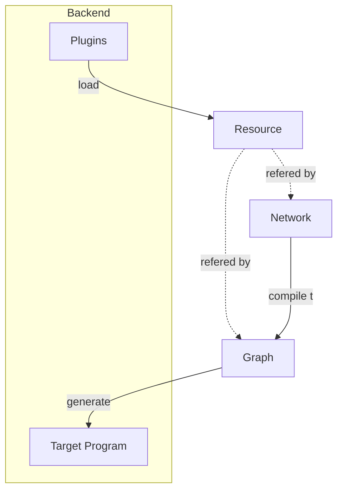
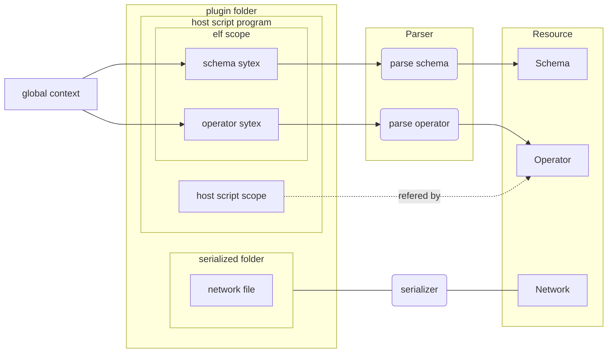

# Developer Guide
## Pipeline

## Backend

- [global context]():reserved words in host script which compose the elf scope.
- [Schema](core/src/common/schema.rs)
- [Operator](core/src/common/operator/)
- [Parser](core/src/backend/mod.rs)

