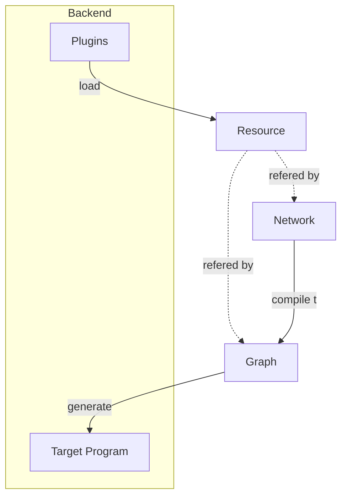
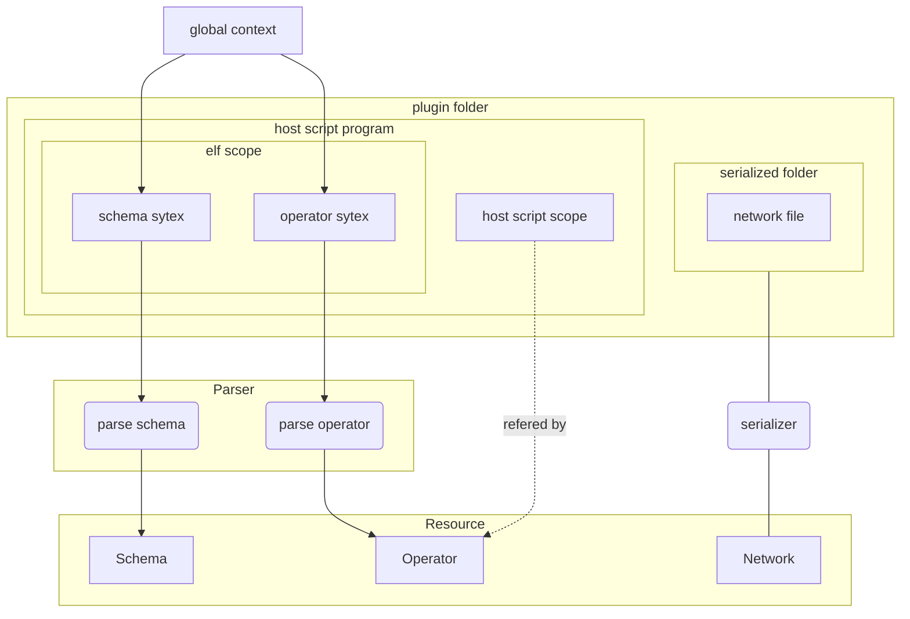
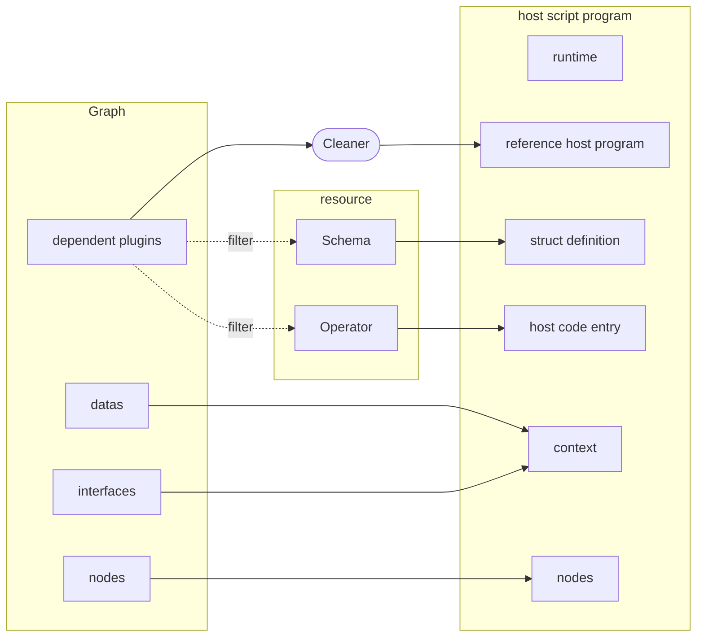
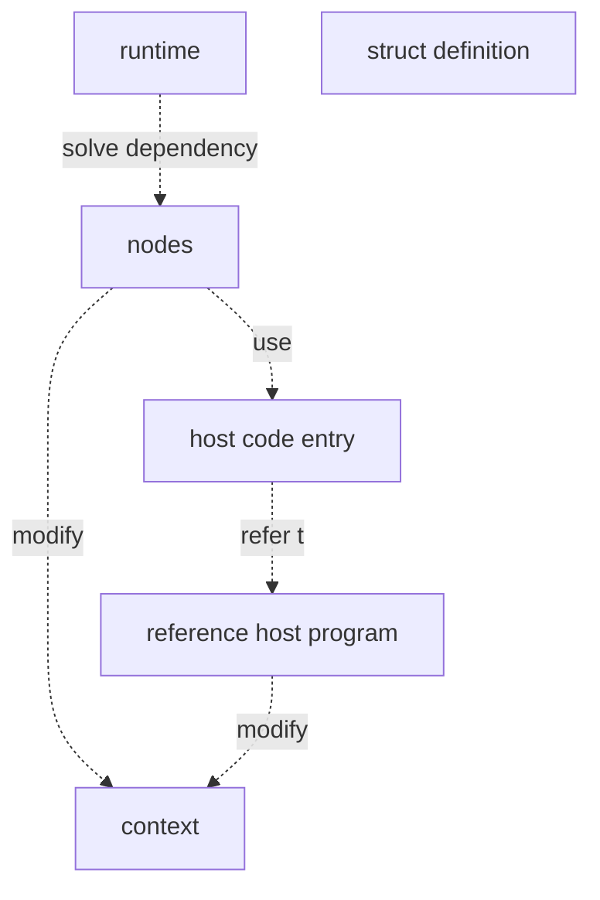

# Developer Guide
## Pipeline

## Backend
### Load

- [global context]():reserved words in host script which compose the elf scope.
- [Schema](core/src/common/schema.rs):backend irrelevant.
- [Operator](core/src/common/operator/):refers to host script code's location.
- [Parser](core/src/backend/mod.rs)
### Generate

- [Graph](core/src/graph/mod.rs):low level dependency graph.
- [Cleaner(taichi)](core/src/backend/taichi/generator/cleaner/mod.rs):remove elf scope from host program.
### Host Program

- [runtime(taichi)](core/src/backend/taichi/generator/__init__.py):dependency graph solver.
- [host code entry]():find function entry in reference host program. 

