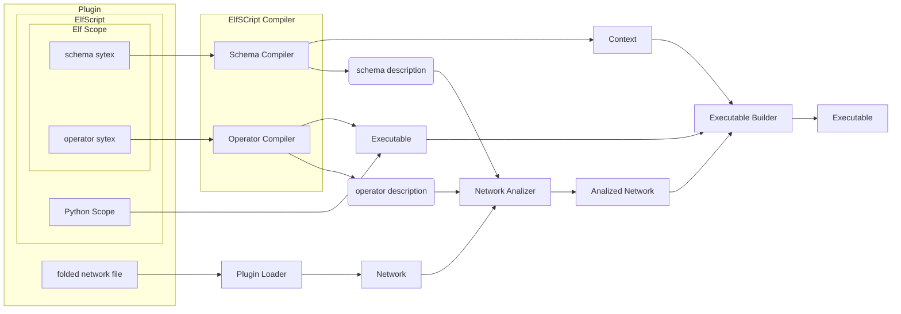
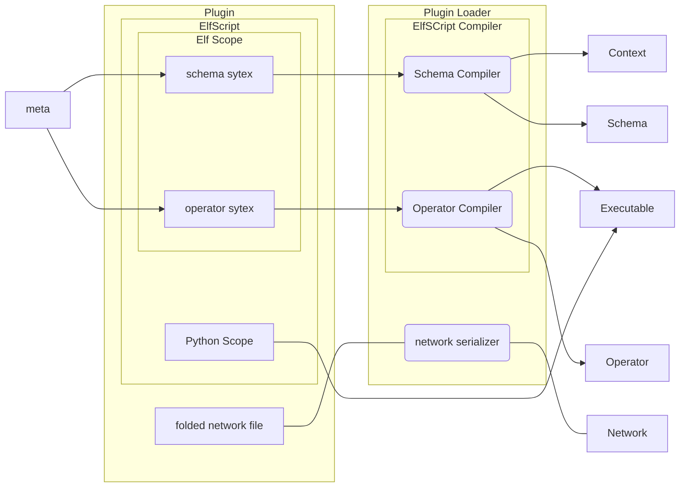

# Developer Guide
## Pipeline

## Plugin Loader

- [meta](meta):python code that won't be executed,only import to elfscript
for code hint.
- [Schema](code/common/schema.py):the description of a schema.
- executable:a python class that actually perform the data
modification via context.
- [Operator](code/common/operator_resource.py):the description of a operator.
- context:the python object actually sent to executable. 
