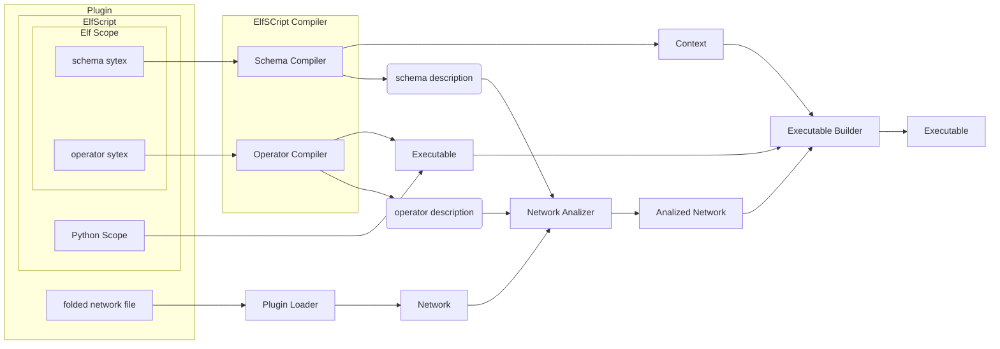

# Developer Guide
## Pipeline

```mermaid
graph LR
    subgraph pg[Plugin]
        subgraph es[ElfScript]
            subgraph ecope[Elf Scope]
                sm[schema sytex]
                op[operator sytex]
            end
            pycope[Python Scope]
        end
        fn[folded network file]
    end
    subgraph ec[ElfSCript Compiler]
        smc[Schema Compiler]
        opc[Operator Compiler]
    end
    sm-->smc-->con[Context] & smd(schema description)
    op-->opc-->exe[Executable] & opd(operator description)
    pycope-->exe
    pgld[Plugin Loader]
    fn-->pgld-->net[Network]
    netan[Network Analizer]
    smd & opd & net-->netan-->annet[Analized Network]
    exebd[Executable Builder]
    con & exe & annet-->exebd-->exeres[Executable]
```