# Elf -- A node based operator network based on taichi-lang
Features:
1. GPU Parallel:with the powerful taichi-lang,we don't have to
write low level compute shader to run parallel algorithm on GPU.
2. Improved Dependency Graph:like Unreal,Houdini,Blender,we use a dependency
graph to organize an algorithm in higher level,which brings much 
more flexibility and intuitiveness.However,we have made some changes
to improve some aspects.
3. Embed into other Engine by transferring data via socket.This 
overhead may limit the application in per-frame real-time affairs.

catalogue:
- [Application](#application)
- [Network](#network)
  - [Basic Idea](#basic-idea)
  - [Basic Node](#basic-nodes)
  - [Dataflow](#dataflow)
  - [Interface](#interface)
  - [Schema](#schema)
- [Nodes](#nodes)
  - [Effect Node](#effect-node)
  - [Reform Node](#reform-node)
  - [Generic Node](#generic-node)
  - [Network Node](#network-node)
  - [Cluster Node](#cluster-node)
- [Template Network](#template-network)
- [Plugin](#plugin)
  - [Directory Structure](#directory-structure)
  - [Compile To Taichi](#compile-to-taichi)
- [Advantages Over The Node System Of Houdini](#advantages-over-the-node-system-of-houdini)
- [Read More](#read-more)
## Application
### Embed Into Unity Or Other Python Program
We have a socket program to handle data transfer and action 
invoke affairs written in both C# and python,giving chance to
embe Elf in Unity.

Normally we hope to use Elf in the field of computer graphics,
like geometry processing,physical simulation,ray tracing rendering,
loading some data from Engine,use an algorithm to process it them
send back.

However,our design is based on general purpose.So Elf may be used
to machine learning,embed into a python program with or without
using the socket program as it is written in python.
## Network
### Basic Idea
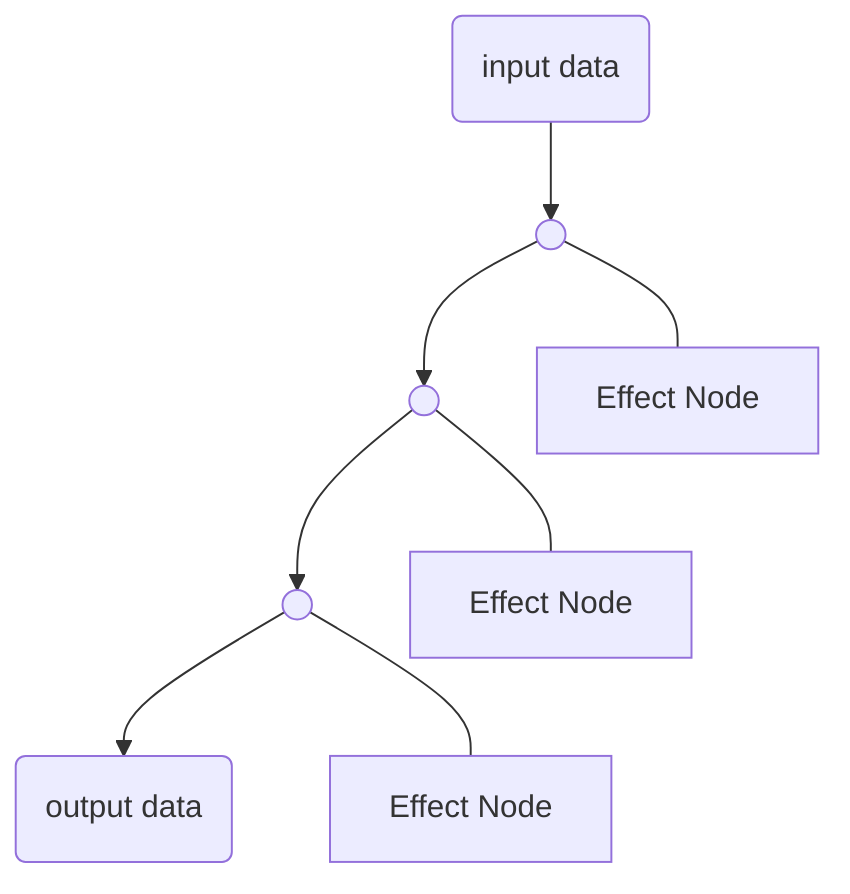
Use effect nodes' side effect on data as the basic process unit,
dataflow are reference to actual data,
generate branches sent to effect nodes to be processed.

As long as each branched dataflow is only sent to one operator
that actually modify the data,
the dependency is clear.
### Basic Nodes
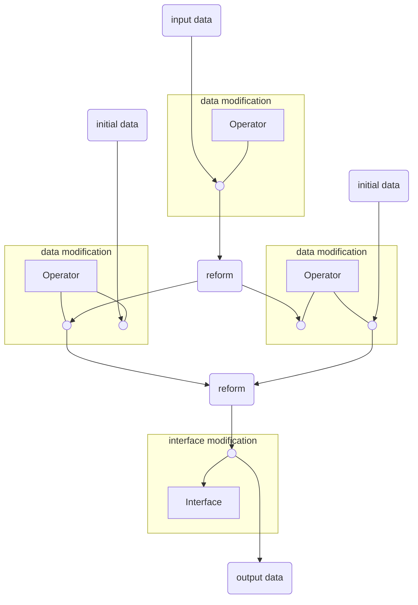
- input data:generator a dataflow contains the input datas
of the network. 
- initial data:generate a dataflow contains arbitrary data.
- Operator Node:a type of effect nodes that mainly read and
modify data flowed in,via an interface on the
flow that compatible with the operator's schema.
- Interface Node:a type of nodes that edit the interfaces on
data flow,leave the data untouched.
- reform:redistribute the interfaces in the input dataflows
to its outputs,like merging,split or exchange.
- output data:end a dataflow.Need to be filled by a dataflow
with a interface compatible with the node's schema.
### Dataflow
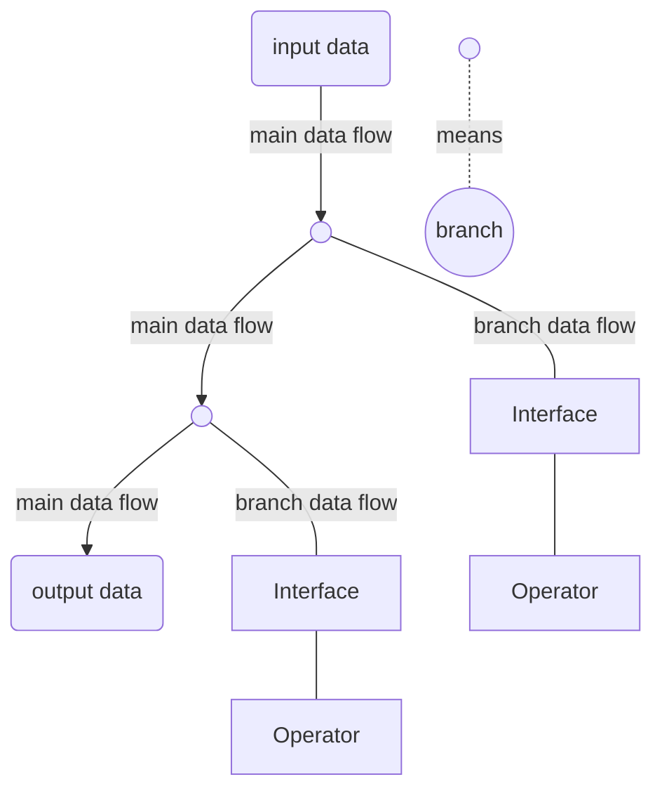
Dataflow comes from a node's output and is sent to another
node's input,contains interfaces referring to the actual data.
- main data flow:from where branch data flow could branch.
- branch data flow:could not branch.

Branching do not change the content of the dataflow,just a 
constraint to make sure the process order is clear.

As a result,there only exist linear main dataflow determined
a linear dependency,which indicated a determined sequence of
processing.
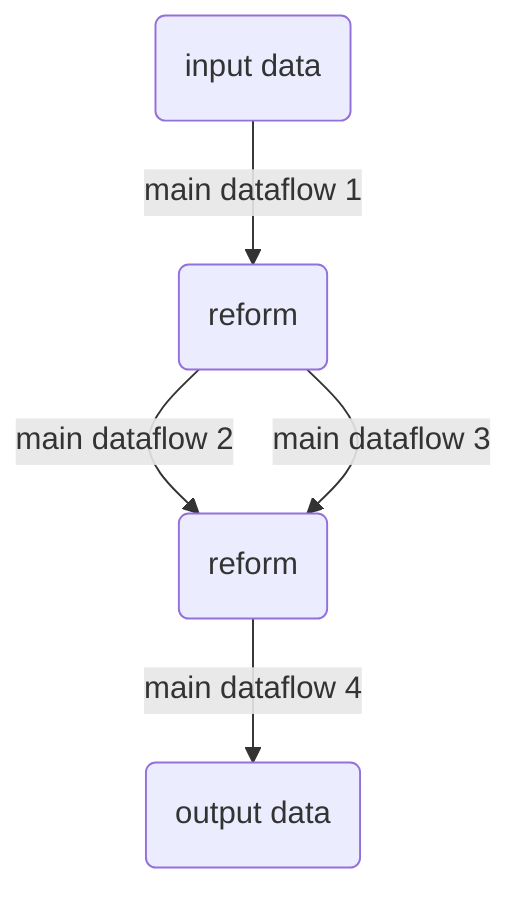
There may exit multiple main dataflows in a network,some have
dependency while some are not.

In this case,dataflow 2,3 depend on 1,4 depend on 2,3.Dataflow
2,3 are independent of each other
### Interface
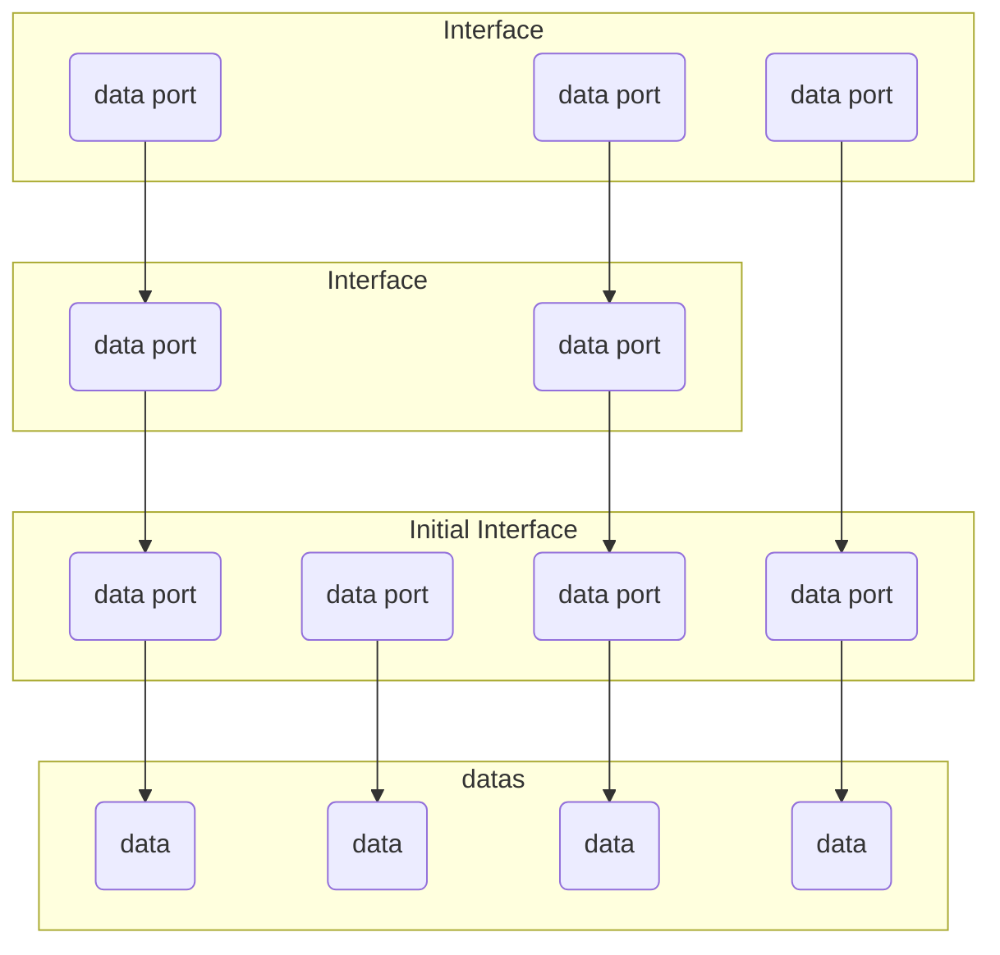
Interface is a reference to a subset of the actual data.It limits
operators and made it possible for one operator to
process on multiple differently structured dataflows via interfaces
in same schema.

Interface has a nestable structure of a set of data port.The
structure is derived from the schema,which will
be covered latter.

Data port is a reference to the actual data or a data port of
another interface.However,a data port finally indicate an actual
data via the reference chain.

In a data flow,interfaces lay on each other.
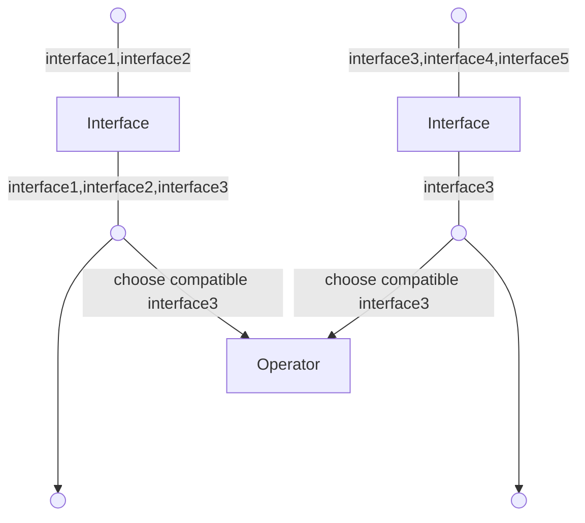
Interfaces flow down with dataflow,edited by 
interface node.When an operator perform process
on a data flow,it has to choose an interface with compatible
schema from the dataflow,to perform on.
### Schema
```python
#use elfscript to define Shcema 
class Schema1:
    field1:int
    field2:int[3]
    field3:float[3]
    shape_constriant1=ShapeConstraint(field2,field3)
    readonly(field1)
class Shcema2:
    field1:Schema1
    field2:float[3]
    field3:int[1]
    field4:float[1]
    field5:str
    shape_constraint1=ShapeConstraint(field1.shape_constrian1,field2)
    shape_constraint2=ShapeConstraint(field3,field4)
    readonly(field3,field1.field2)
```
Schema is a description of a nestable data structure like many 
General-purpose programming languages.It's the way an operator,
or your code,access the data.
#### Field Type Annotation
```python
<field_name>:<type>[<dimension>]
"""compile to:"""
self.field_name=taichi.field(dtype=<type>,shape=(...))
#len(shape)=<dimension>
```
A type annotation with a subscript stands for a
taichi field of particular type,the index stands for the dimension.
However,the size of each dimension,or shape,is not a part of the
schema definition,should be considered changing all the time.

A type annotation without subscript stands for itself.
#### Shape Constraint
```python
<shape_constraint_name>:ShapeConstrain(<field_name>[,...])
```
Some datas are logically a struct
of array that different components of a struct are stored in
separate data,which means they share a same shape
and same domain of index.Group some primitives or defined shape
constraints into a new shape constraint,which provide memory
allocation method and a specific index type only allowed to use in
constrained members.
#### Readonly Constraint
```python
readonly(<field_name>[,...])
```
To know the datas been modified is crucial to Optimize the 
duplication.Before Elf have a more powerful code analyzer to
automatically figure out a Operator's code's modification,
you are supposed to use readonly constraint to help the 
information collection.

What's more,the output data's usage,which is beyond Elf's
control,can only be optimized via readonly constraint.
## Nodes
A node have one or multiple input dataflows and one or multiple
output dataflow.
### Effect Node
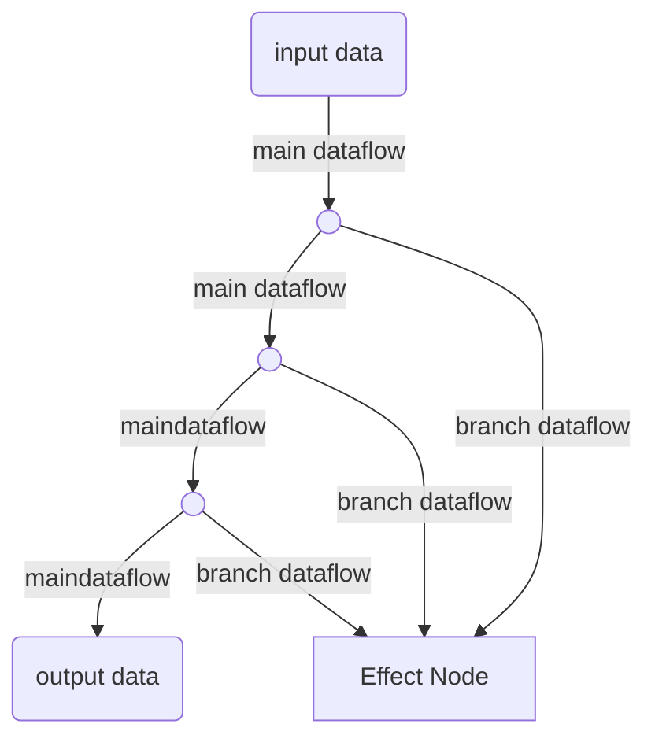
Only accept a particular type of
input and generator a particular type of output,which means
these node's functions are not depend on the network,but defined
separately,stored separately.

Only use side effect to modify interfaces in dataflow and datas,
so only accept branch dataflow input,has no output.
When have multiple inputs,
effect node effect each dataflow independently.
#### Interface Node
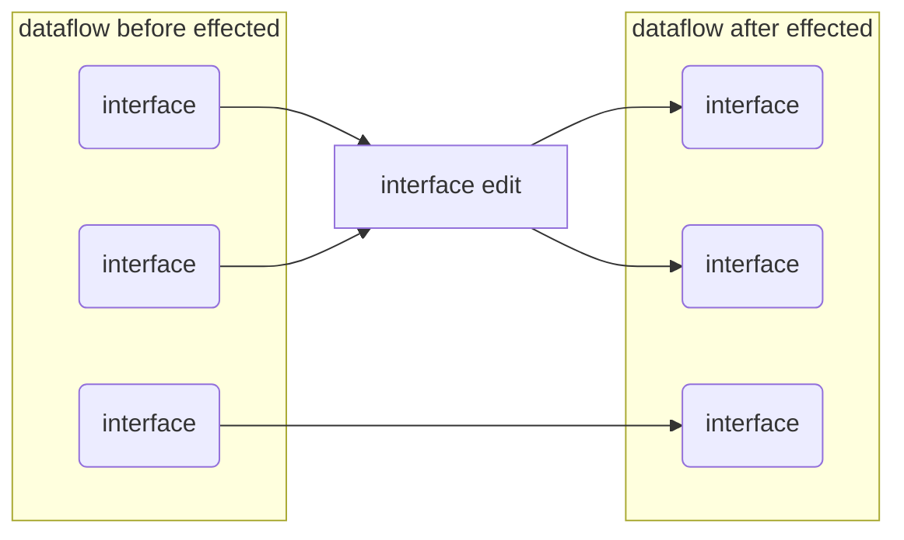
Accept a particular set of interfaces from one dataflow.
Edit the accepted interfaces,remove,append,or
modify its data ports' references,readonly constraints.However,
shape constraints should not be changed once they are created.
At last apply its edit action to input dataflow as its output.
#### Operator Node
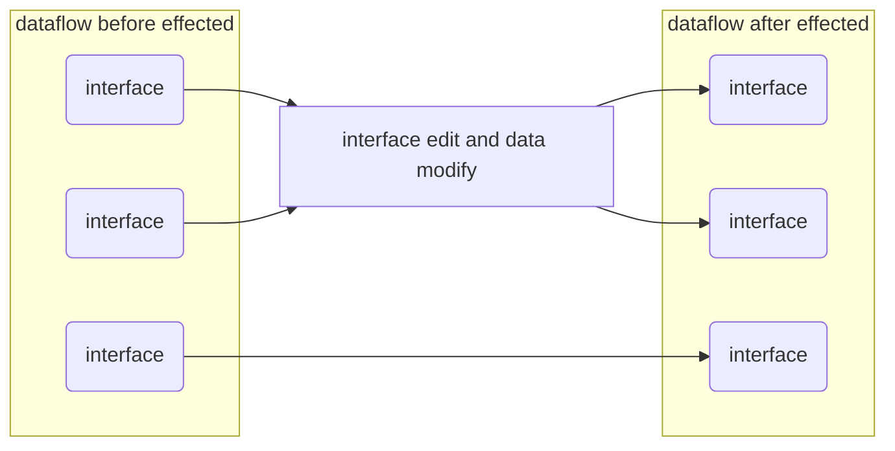
Accept a particular set of interfaces from one dataflow.
Edit the accepted interfaces as interface node do,
as well as modify the data via the interfaces.
### Reform Node
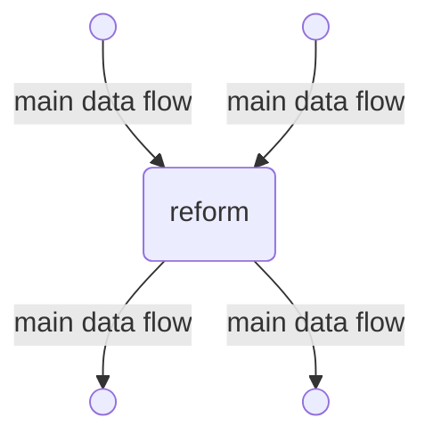
Input multiple main dataflows and output multiple main dataflows
with interfaces in accepted interfaces.

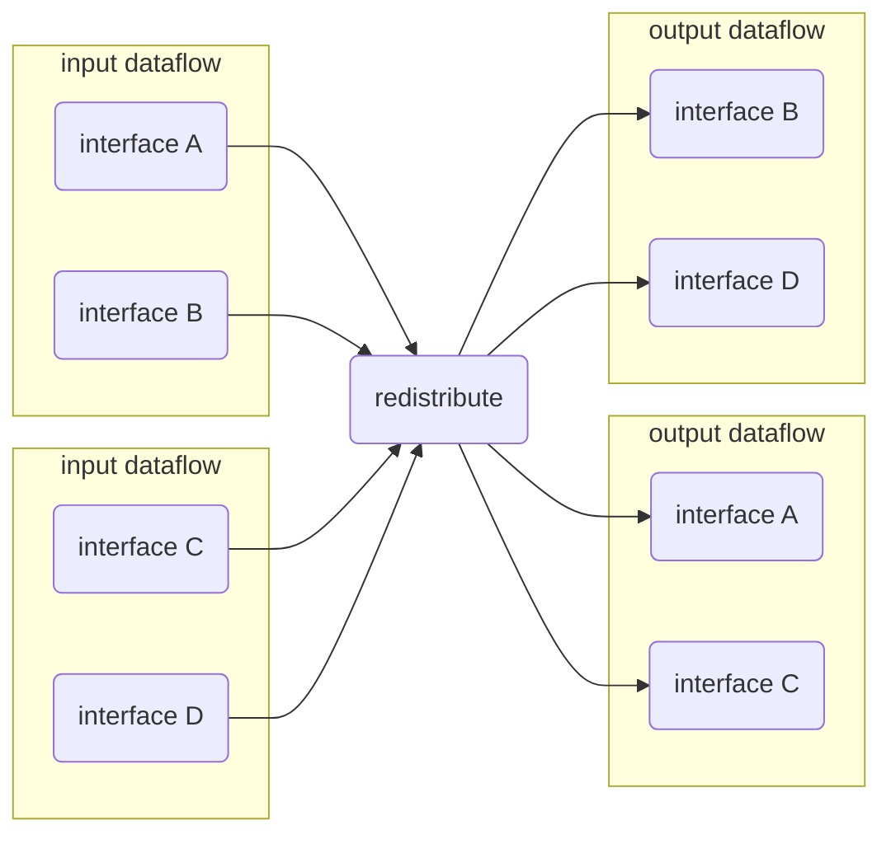
Interfaces redistribution can be used to merge,split,blend,exchange
interfaces in multiple input dataflows.

Each output dataflow is independent of others
guaranteed by data duplication.
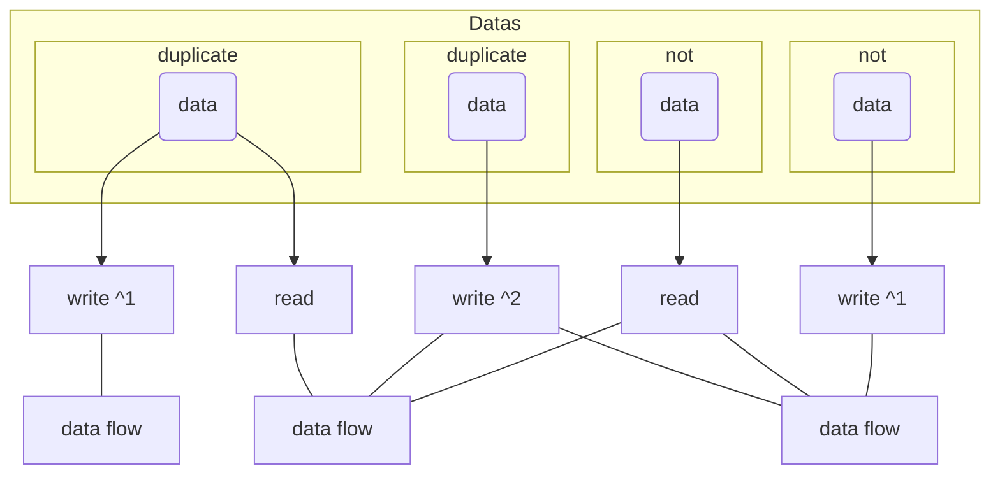
To figure out the way with minimum duplications of data,
Elf will collect the following read and write on data port for each
data flow.

For each port,according to the number of data flow that read and
write on it,decide whether a duplication is needed.
### Generic Node
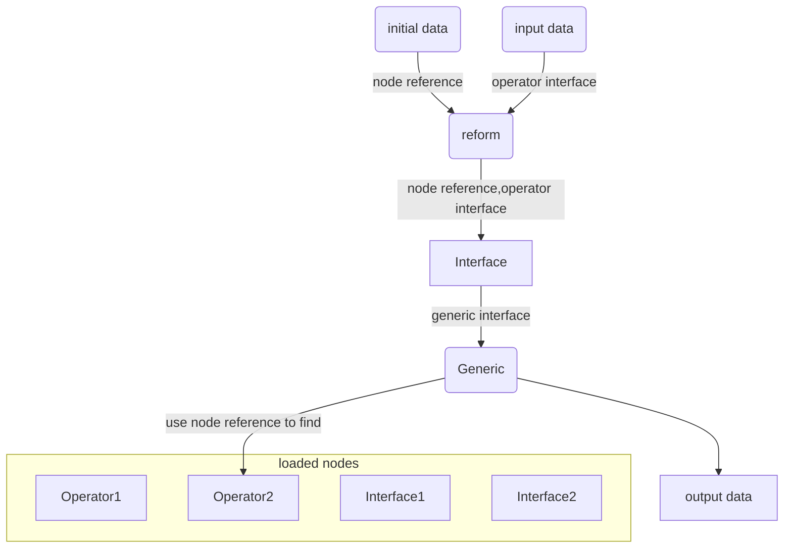
Accept a generic interface that contains node reference data,
use this reference to find the node in loaded nodes,use that
node to process the data in the other part of the interface.
### Network Node
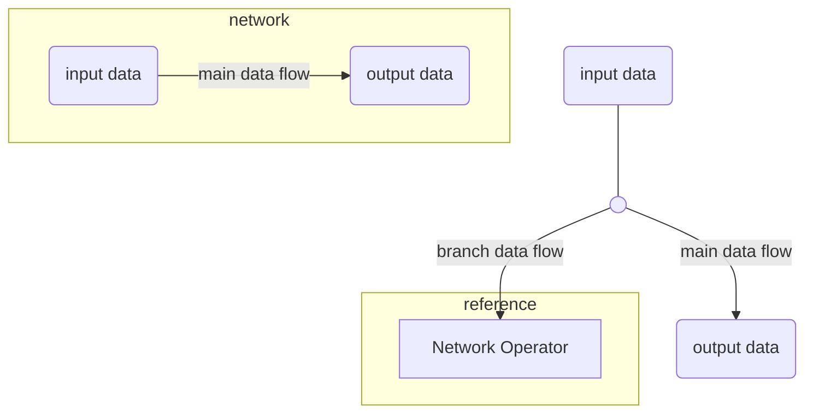
Network can be referred as operator or interface node,
depending on whether data modification exist.
Once a network is loaded,
you can create node refers to the network
1. Network operator's input(output) interface is the same with the 
network's input(output) data node's definition.
2. The dataflow generated by input data node in network
is always main dataflow no matter what the network operator receives.
3. If a branch dataflow is sent to a network operator,the flow
end,and the operator has no output.However,the output data node
in the network still makes sense by indicate the starting 
point for solving the dependency graph.
### Cluster Node
```mermaid
graph TB
    in(( ))
    out(( ))
    cl(clusterized by duplication of one dataflow)
    op1[randomized based on dataflow's order]
    op2[varied based on random data]
    me(reform)
    in--dataflow--- cl==dataflow cluster=== op1==dataflow cluster=== 
    op2==dataflow cluster=== me--dataflow-->out
 ```
```mermaid
graph TB
    in(( ))
    init1(( ))
    init2(( ))
    out(( ))
    cl(clusterized by reform multiple dataflow)
    op1[randomized based on dataflow's order]
    op2[varied based on random data]
    me(reform)
    in & init1 & init2--dataflow--- cl==dataflow cluster=== op1==dataflow cluster=== 
    op2==dataflow cluster=== me--dataflow-->out
 ```
Seemingly merge multiple dataflow into one like reform node,
actually every dataflow
is still separated.When node process on a dataflow cluster,
they process each dataflow inside separately.

Its usage is quite similar to the Task Operator Network or PDG
in Houdini.The philosophy behind this is that operator should
get its parameter from input data instead of attributes of the node.
That's why there could be scalar data in schema.

With different scalar stored in data,a cluster is not processed
uniformly.Combined with reform,it could be used
to make varieties.
## Template Network
When writing code,we can make a function that accept a function
as its parameter and use it inside.Our network has no reason
not to support such thoughtful idea.
```mermaid
graph TB
    subgraph g1[network]
        in(input data)
        out(output data)
        o1(( ))
        o2(( ))
        in--- o1--- o2--main data flow-->out
        o1 & o2--branch dataflow-->o3(Operator)  
    end
```
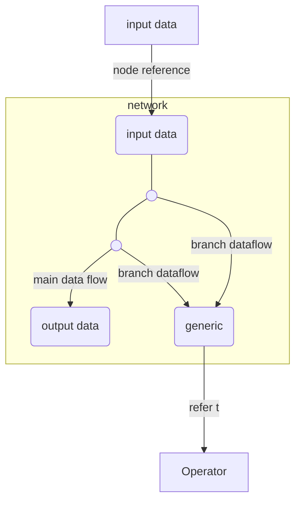
Operator or interface node can input multiple branch dataflows,
the node have to perform same processing on each input.

Use branch dataflow with combination of generic node gives
a feature of template network.
## Plugin
In Elf,a project is a plugin.
### Directory Structure
- \<plugin name>
  - infor.json
    ```json
      {
        "dependency": [
          {"git": "a valid git-url of the dependent plugin from where it will be download",}
        ],
        "version":[0,0,1],
        "name": "template",
        "description": "template plugin for instruction",
      }
    ```
  - code
    - \<any script name>.py
      ```python
        import meta as elf
        @elf.schema
        class Ray:
          start:elf.vec3[1]#field data,dimension is 1
          direction:elf.vec3[1]
          all_sc=elf.ShapeConstrain(start,direction)
        @elf.schema
        class Light:
          ray:Ray#refers to Ray
          energe:float[1]
          line_sc=elf.ShapeConstrain(ray.all_sc,energe)
          density:float[3]#dimension is 3
          mode:int#scalar primitive
          elf.readonly(density,mode)
        @elf.operator
        class MoveLight(elf.Operator):
          def process(self,light:Light,initial:Ray):#entry:parameter type determines the accepted schema
              for index in elf.ndrange(light.line_sc.shape):#get shape from ShapeConstrain
                  start=light.ray.start[index]
                  direction=light.ray.direction[index]
                  energe=light.energe[index]
                  light.ray.start[index]+=direction*energe*light.density[round(direction)]*light.mode
      ```
  - network
    - \<network name>.network
    - \<interface node name>.interface
- ./infor.json:description of the plugin.
- ./code:define schema,write code for primitive operator,
all .py scripts will be analyzed
- ./code/\<any script name>.py:an code example.
- ./network:store network files and interface node files
build by Elf.
- ./network/\<network name>.network:an example network file
that inner content should only be accessed via Elf. 
- - ./network/\<interface node name>.interface:an example interface
file that inner content should only be accessed via Elf. 

When editing a plugin's network in Elf,only nodes
defined in the same plugin or its dependent plugin is available.
### Compile To Taichi
```python
  #exists else where
  @taichi.data_oriented
  class ShapeConstrain:
      def __init__(self,shape:tuple[int]):
          self.shape=shape
  #compile result
  @taichi.data_oriented
  class Ray:
      def __init__(self,all_sc:tuple[int]):
          self.start=taichi.field(vec3,shape=all_sc)
          self.direction=taichi.field(vec3,shape=all_sc)
          self.all_sc=ShapeConstrain(all_sc)
  @taichi.data_oriented
  class Light:
      def __init__(self,line_sc:tuple[int],density:tuple[int]):
          self.ray=Ray(line_sc)
          self.energe=taichi.field(float,shape=line_sc)
          self.line_sc=ShapeConstrain(line_sc)
          self.density=taichi.field(float,shape=density)
          self.mode=int()
  @taichi.data_oriented
  class MoveLight:
      @taichi.kernel
      def process(self,light:taichi.template(),initial:taichi.template()):
          for index in taichi.ndrange(light.line_sc.shape):
              start=light.ray.start[index]
              direction=light.ray.direction[index]
              energe=light.energe[index]
              light.ray.start[index]+=direction*energe*light.density[round(direction)]*light.mode 
```
## Advantages Over The Node System Of Houdini
1. Data are typed by schema.While houdini has no type system.
2. Interface gives an convenient way for operator to
process data in different schema.While houdini have to specify
the way operator interpret the data, on operator itself.
3. Duplication is minimized.While houdini have duplication on nealy 
every node.
4. Data and Operation are separated while houdini mixed them into 
nodes.
5. One operator can accept multiple input data flow in different
structure as long as they share a same access schema that compatible
with the operator.In houdini,you have to specify the way operator
process the data for every input,and have to group the inputs to
one,send to the operator then split them again.
6. Operators work by its side effects,rather than copy it then modify
it and pass it on.However,houdini use purely functional semantics.
7. Operator can be viewed as an input to another operator,
Which can hardly be done in houdini.
8. To meet the need illuminated in [5]() and [7](),in houdini,
you may make references from multiple nodes to one node,
the one node is viewed as a parameter to the network that refers
to it,or viewed as a node process the data in the nodes that 
refers to it.However,you cannot change the referred node's type
or the reference on attribute level would fail to maintain.Now
you can easily achieve that via Elf.
9. Only use part of the accessed data as the parameter of the
operator,no property panel for the operator,which is born 
procedural.In Houdini,it's cumbersome to extract the data then
refer to them in property panel.To describe the dependency
between the properties Houdini applied property reference,
which is hard to visualize and debug.When the network grows
bigger,that will lead to a disaster.
## Read More
1. [Developer Guide](developer%20guide.md)


