# Elf -- A node based operator network based on taichi-lang
features:
1. parallel process:with the powerful taichi-lang,we don't have to
write low level compute shader to run parallel algorithm on GPU.
2. dependency graph:like Unreal,Houdini,Blender,we use a dependency
graph to organize an algorithm in higher level,which brings much 
more flexibility and intuitiveness.However,we have made some changes
to improve some aspects.
3. Embed into other Engine by transferring data via socket.This 
overhead may limit the application in per-frame real-time affairs.

catalogue:
1. [Application](#application)
2. [Network](#network)
   1. [Basic Node](#basic-node)
   2. [Data Flow](#data-flow)
3. [Data Access Schema](#data-access-schema)
   1. [Interface:Edit Schemas of Data Flow](#interface--edit-schemas-of-data-flow)
4. [Duplicate](#duplicate)
5. [Network Folding](#network-folding)
6. [Branch Data Flow:Template Programming](#branch-data-flow--template-programming)
7. [Cluster](#cluster)
8. [Merge](#merge)
9. [Plugin](#plugin)
   1. [Directory Structure](#directory-structure)
   2. [Compile To Taichi](#compile-to-taichi)
10. [Advantages Over The Node System Of Houdini](#advantages-over-the-node-system-of-houdini)
11. [Read More](#read-more)
## Application
### Embed Into Unity Or Other Python Program
We have a socket program to handle data transfer and action 
invoke affairs written in both C# and python,giving chance to
embe Elf in Unity.

Normally we hope to use Elf in the field of computer graphics,
like geometry processing,physical simulation,ray tracing rendering,
loading some data from Engine,use an algorithm to process it them
send back.

However,our design is based on general purpose.So Elf may be used
to machine learning,embed into a python program with or without
using the socket program as it is written in python.
## Network
### Basic Node
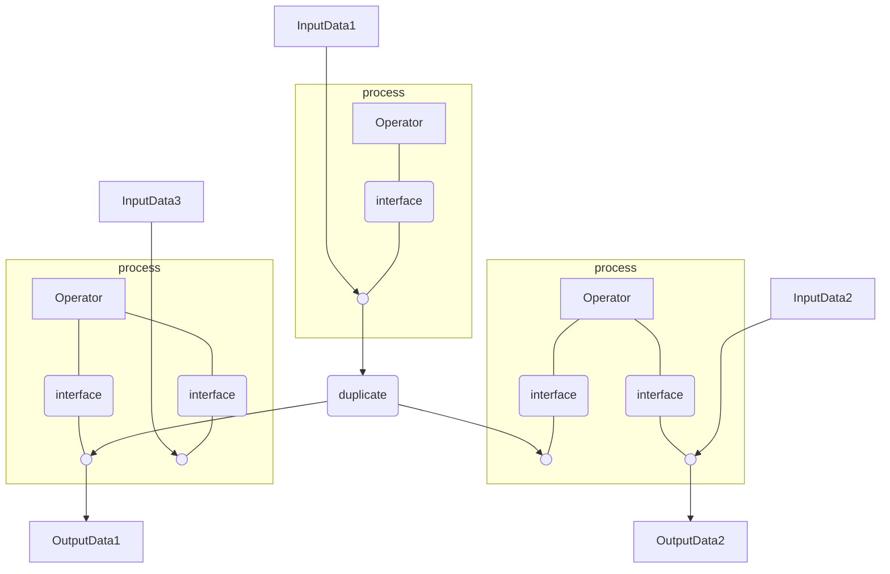
1. InputData:data in particular access schema while memory schema could vary.
2. Operator:access and even modify data in particular access schema.
3. interface:edit schema on data flow,add or delete,and make sense of the added.
4. duplicate:when accessed by multiple operator,data need to be duplicated,or previous access would affect the latter.However,read only access would not,so there won't be duplication for that.
5. OutputData:data in particular access schema that need to be filled.
### Data flow
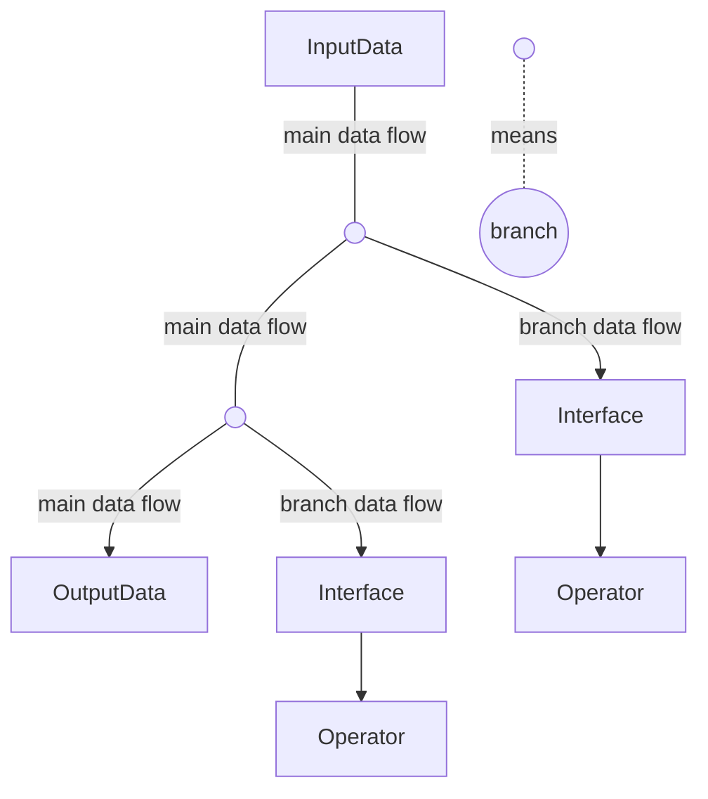
1. Both of the data flow can be sent to only one node with compatible access schema then end.
2. main data flow:from where branch data flow could branch.The order of branch indicates the order of process.
3. branch data flow:could not branch.
4. As a result,there only exist one main data flow to determine the only process order.
## Data Access Schema
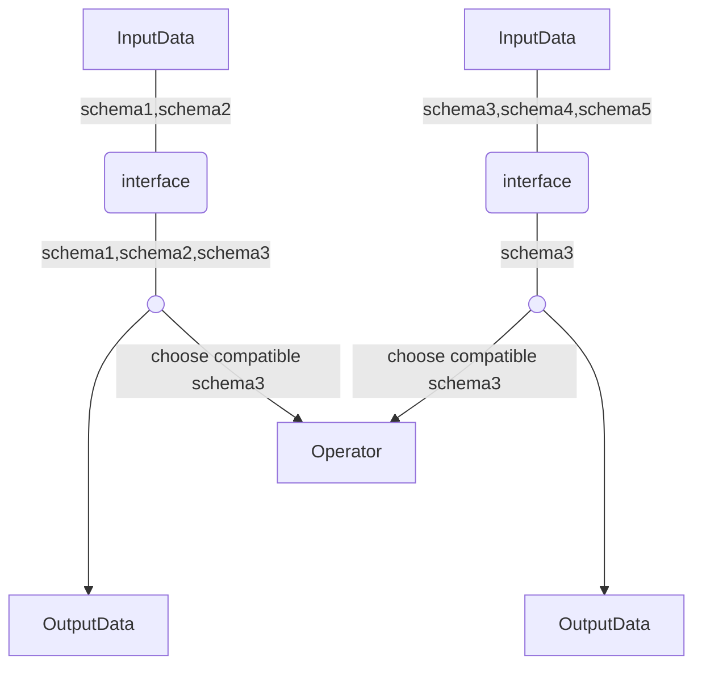
Data flow can have multiple access schema on it.When a operator
perform process on a data flow,it has to choose a compatible
schema to perform on.Access schema is a subset of the original data
so it limits operators and made it possible for one operator to
process on multiple differently structured data flow in the same
access schema.
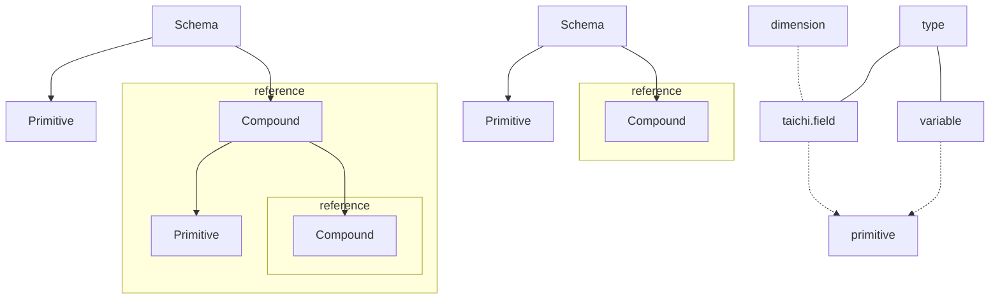
Data in schema are made into multiple data port to be accessed,
which is structured like:
1. Primitive:accessible port in field or variable form of a certain type like int,float3,etc.The access schema can specify field primitive's dim or not,which means any operator processing in such schema should be independent of size on each dimension or even dimension.However,field's shape is changing all the time while accessible,so schema should never specify it.
2. Compound:a namespace for its sub-primitives and sub-compounds.Apart from the name,it should be a reference to another defined access schema.
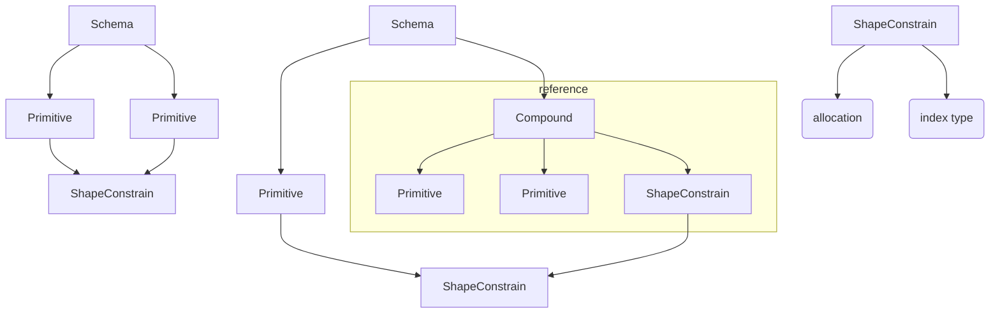
3. ShapeConstrain:some field primitives are logically struct
of array that different components of a struct are stored in
separate field primitives,which means they share a same shape
and same domain of index.Group some primitives and defined shape
constrain into a new shape constrain,which provide memory
allocation method and a specific index type only allowed to use in
constrain members.
### Interface:Edit Schemas of Data Flow
Besides the schema exists since the data flow was created,interface
can add a new one to the data flow,by making references to the
data port of existing schema. 
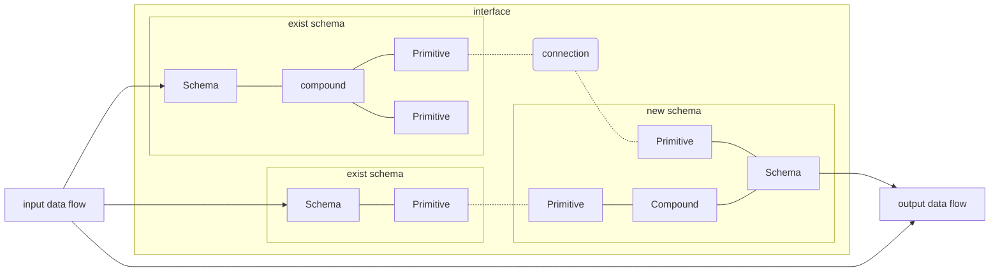
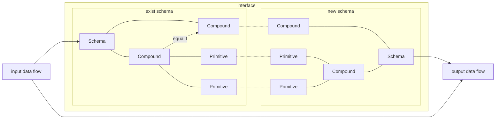
1. connection:define a reference from one data port of the new schema
to a exists schema's data port.It can be performed
on two primitives or two Compound in compatible schema.Performing
on Compound is equal to performing on every component of it.
2. The output data flow is not a duplication but a
reference to the existed Data's subset.
3. The type of data flow won't change from 
input to output.Branch data flow use this to fit the access schema
of the operator it is sent to;main data flow use this to change access
schema for next part of the network. 
## Duplicate
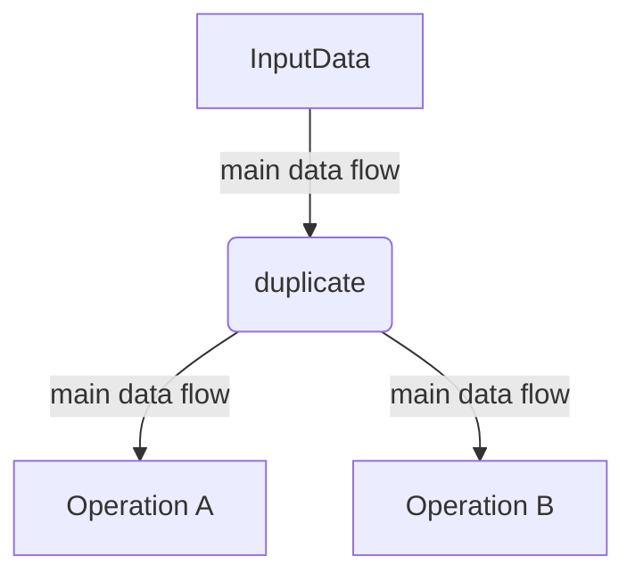
1. Output multiple main data flow,each one is independent of others.
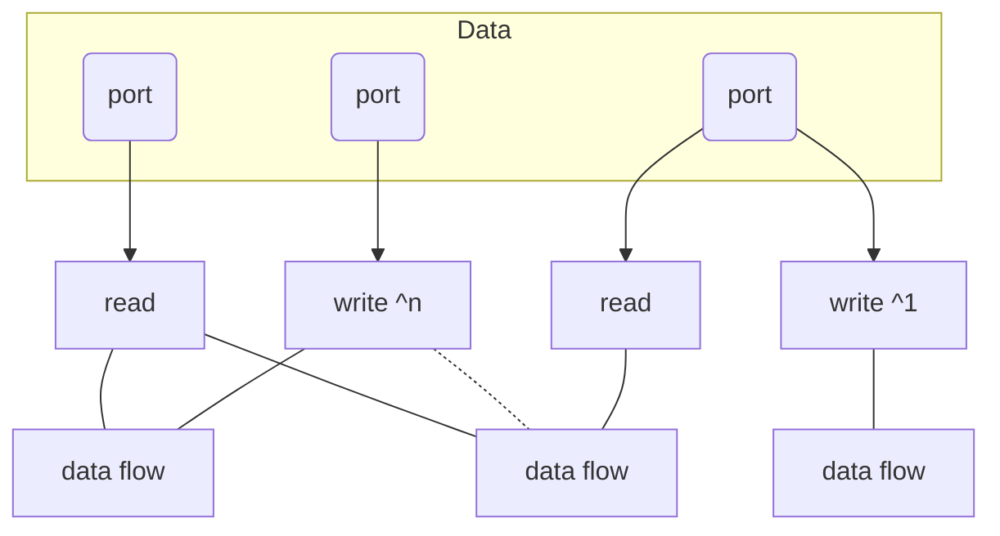
2. To figure out the way with minimum duplications of port data,collect the following read and write on port for each data flow
3. For each port,according to the number of data flow that read and write on it,decide whether a duplication is needed.
## Network Folding
Network can be folded as operator.
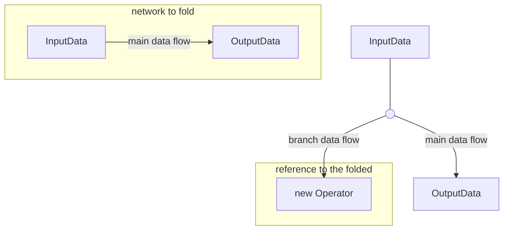
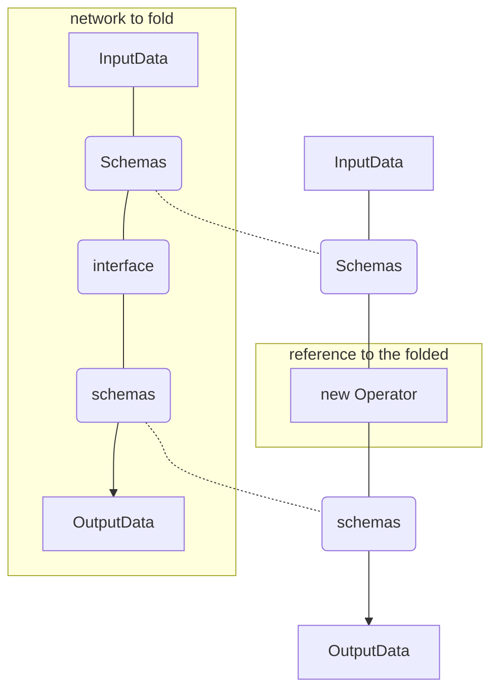
1. The new operator's access schema is the same with the schema
of input data node in the network.
2. The data flow pulled out of the input data node in the network
is always main data flow no matter what the new operator receives.
The process order is to process the network inside an operator then
next operator.
3. If a branch data flow is sent to the new operator,the flow
end,and the operator has no output.However,the output data node
in the network is still make sense by acting as the starting 
point for solving the dependency graph indicated by the network.
4. If a main data flow is sent to the new operator,the operator
generate a main data flow with schemas indicated by the output
data node of the network.
5. From this point of view,interface node is a kind of operator
except that it can pass branch data flow on because it actually
changes the data flow while keeps the data untouched.
## Branch Data Flow:Template Programming
When writing code,we can make a function that accept a function
as its parameter and use it inside.Our network has no reason
not to support such thoughtful idea.
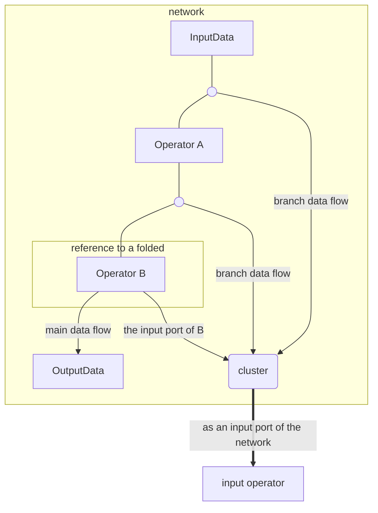
The process in the network first execute the input node outside,
then the operator A,then the input operator again,then B.And 
During the process in B,the data flow branches somewhere inside B,
out to the network,merged then out to input operator and execute 
it once again.
## Cluster
Seemingly merge multiple data flow into one,actually every data flow
is still separated.When operator process one a data flow cluster,
it process each data flow inside separately.

Its usage is quite similar to the Task Operator Network or PDG
in Houdini.The philosophy behind this is that operator should
get its parameter from input data instead of attributes.And that's
why there could be variable primitive in access schema.

With different variable stored in data,a cluster is not processed
uniformly.Combined with duplicate,it could be used
to make varieties.
```mermaid
graph TB
in[InputData]
out[OutputData]
cl(cluster with duplication)
op1[randomized based on data flow's order]
op2[variation based on random data from its access schema]
me(merge)
in--- cl=== op1=== op2=== me-->out
 ```
## Merge
Merge actually merge multiple data flow into single one,union
there access schemas,and create shape constrain.This is used
when we add additional structure on something like bounding box
or randomize value.
```mermaid
graph TB
    in1[InputData]
    out1[OutputData]
    o11(( ))
    o12(( ))
    nd1[NewData]
    me1[merge]
    op1[compute bounding box]
    in1--schema of triangle--- o11--- me1--schema of triangle and bounding box-->out1
    nd1--schema of bounding box--- o12--- me1
    o12 & o11-->op1
```
## Plugin
In Elf,a project is a plugin.
### Directory Structure
- \<plugin name>
  - infor.json
    ```json
      {
        "dependency": [
          {"git": "a valid git-link of the dependent plugin from where it will be download",}
        ],
        "version":[0,0,1],
        "name": "template",
        "description": "template plugin for instruction",
      }
    ```
  - code
    - main.py
      ```python
        import meta as elf
        @elf.schema
        class Ray:
          start:elf.vec3[1]#field primitive,dimension is 1
          direction:elf.vec3[1]
          all_sc=elf.ShapeConstrain(start,direction)
        @elf.schema
        class Light:
          ray:Ray#compound:refers to Ray
          energe:float[1]
          line_sc=elf.ShapeConstrain(ray.all_sc,energe)
          density:float[3]#dimension is 3
          mode:int#variable primitive
        @elf.operator
        class MoveLight(elf.Operator):
          def process(self,light:Light):#entry:parameter type determines the schema
              for index in elf.ndrange(light.line_sc.shape):#get shape from ShapeConstrain
                  start=light.ray.start[index]
                  direction=light.ray.direction[index]
                  energe=light.energe[index]
                  light.ray.start[index]+=direction*energe*light.density[round(direction)]*light.mode
      ```
  - network
    - \<network name>
1. ./infor.json:description of the plugin.
2. ./code:define schema,write code for primitive operator.
3. ./code/main.py:an code example.
4. ./network:store network directory build by Elf.
5. ./network/\<network name>:an example network that inner content
should only be accessed via Elf. 
6. When editing a plugin's network in Elf,only schemas and operators
defined in the same plugin or its dependent plugin is available.
same plugin 
### Compile To Taichi
```python
  #exists else where
  @taichi.data_oriented
  class ShapeConstrain:
      def __init__(self,shape:tuple[int]):
          self.shape=shape
  #compile result
  @taichi.data_oriented
  class Ray:
      def __init__(self,all_sc:tuple[int]):
          self.start=taichi.field(vec3,shape=all_sc)
          self.direction=taichi.field(vec3,shape=all_sc)
          self.all_sc=ShapeConstrain(all_sc)
  @taichi.data_oriented
  class Light:
      def __init__(self,line_sc:tuple[int],density:tuple[int]):
          self.ray=Ray(line_sc)
          self.energe=taichi.field(float,shape=line_sc)
          self.line_sc=ShapeConstrain(line_sc)
          self.density=taichi.field(float,shape=density)
          self.mode=int()
  @taichi.data_oriented
  class MoveLight:
      @taichi.kernel
      def process(self,light:taichi.template()):
          for index in taichi.ndrange(light.line_sc.shape):
              start=light.ray.start[index]
              direction=light.ray.direction[index]
              energe=light.energe[index]
              light.ray.start[index]+=direction*energe*light.density[round(direction)]*light.mode 
```
## Advantages Over The Node System Of Houdini
1. Data are typed by schema.While houdini has no type system.
2. Interface gives an efficient way for operator to
process data in different schema.While houdini have to specify
the way operator interpret the data, on operator itself.
3. Duplication is minimized.While houdini have cache on nealy 
every node.
4. Operator can be viewed as an input to another operator through
branch data flow.
5. Data and Operation are separated while houdini mixed them into 
nodes.
5. One operator can accept multiple input data flow in different
structure as long as they share a same access schema that compatible
with the operator.In houdini,you have to specify the way operator
process the data for every input,and have to group the inputs to
one,send to the operator then split them again.
6. Operators work by its side effects,rather than copy it then modify
it and pass it on.However,houdini use purely functional semantics.
7. Operator can be viewed as an input to another operator,
Which can hardly be done in houdini.
8. To meet the need illuminated in [5]() and [7](),in houdini,
you may make references from multiple nodes to one node,
the one node is viewed as a parameter to the network that refers
to it,or viewed as a node process the data in the nodes that 
refers to it.However,you cannot change the referred node's type
or the reference on attribute level would fail to maintain.Now
you can easily achieve that via Elf.
9. Only use part of the accessed data as the parameter of the
operator,no property panel for the operator,which is born 
procedural.In Houdini,it's cumbersome to extract the data then
refer to them in property panel.To describe the dependency
between the properties Houdini applied property reference,
which is hard to visualize and debug.When the network grows
bigger,that will lead to a disaster.
## Read More
1. [Developer Guide](developer%20guide.md)


