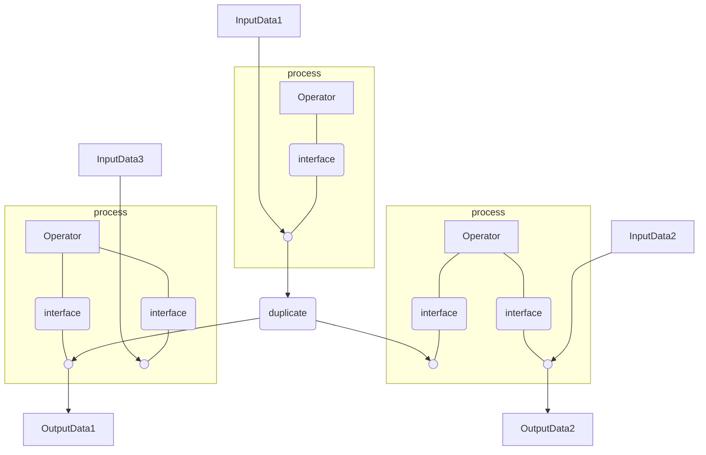
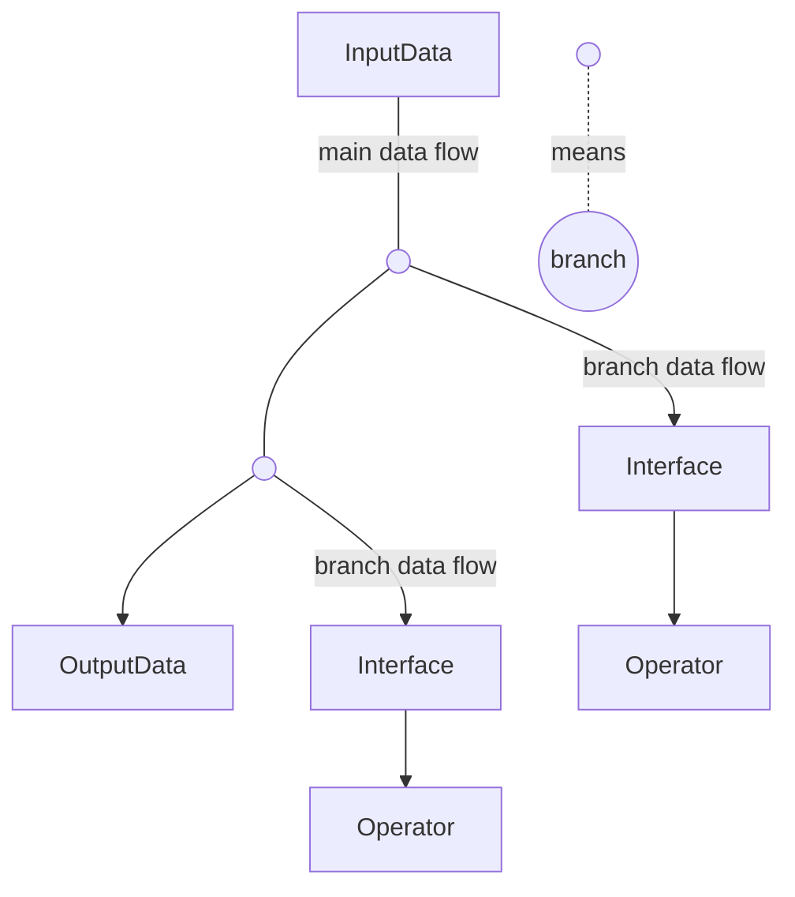
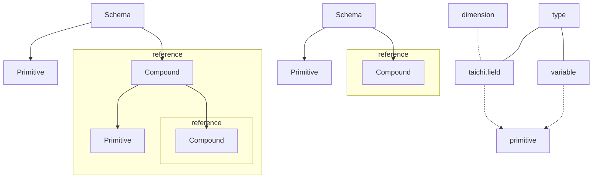
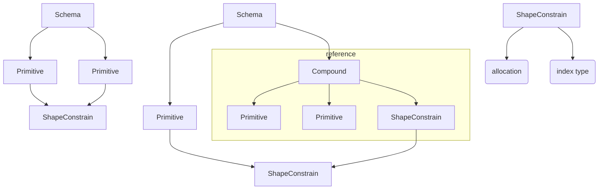
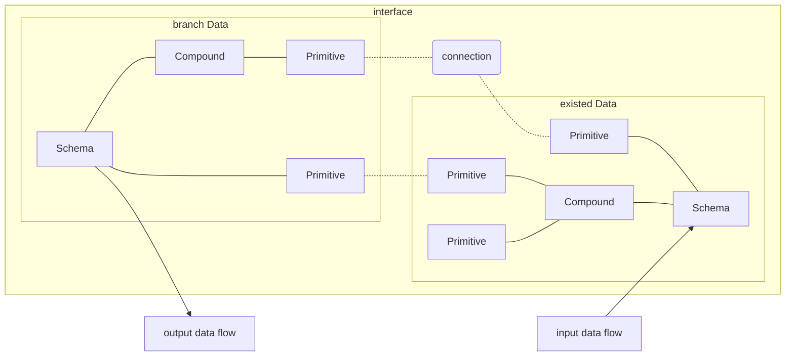
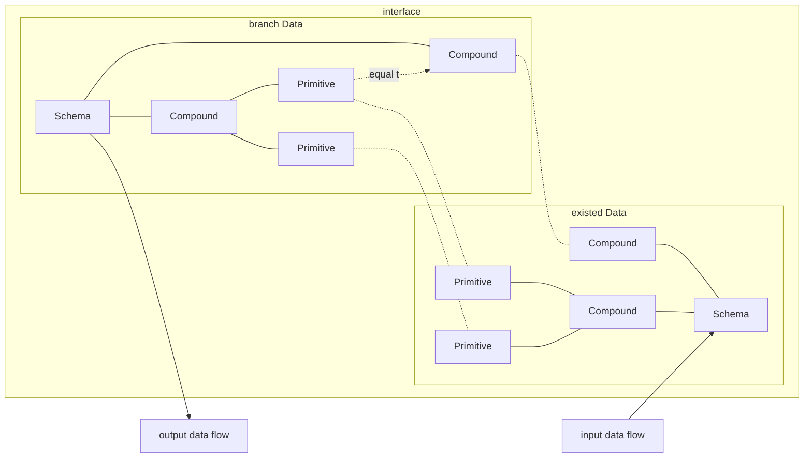
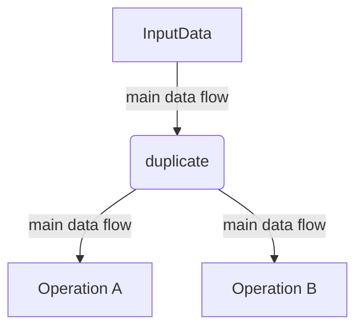
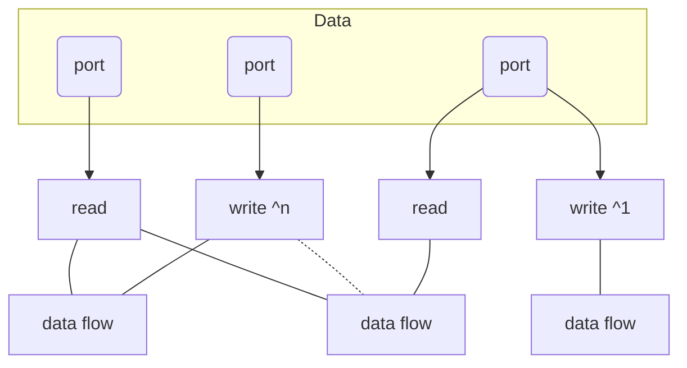
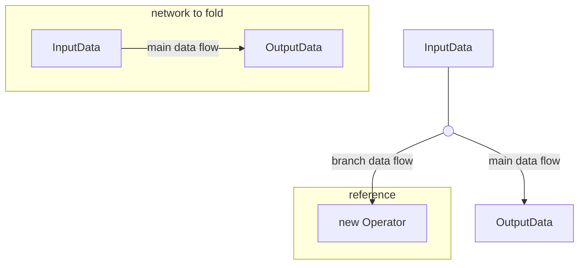
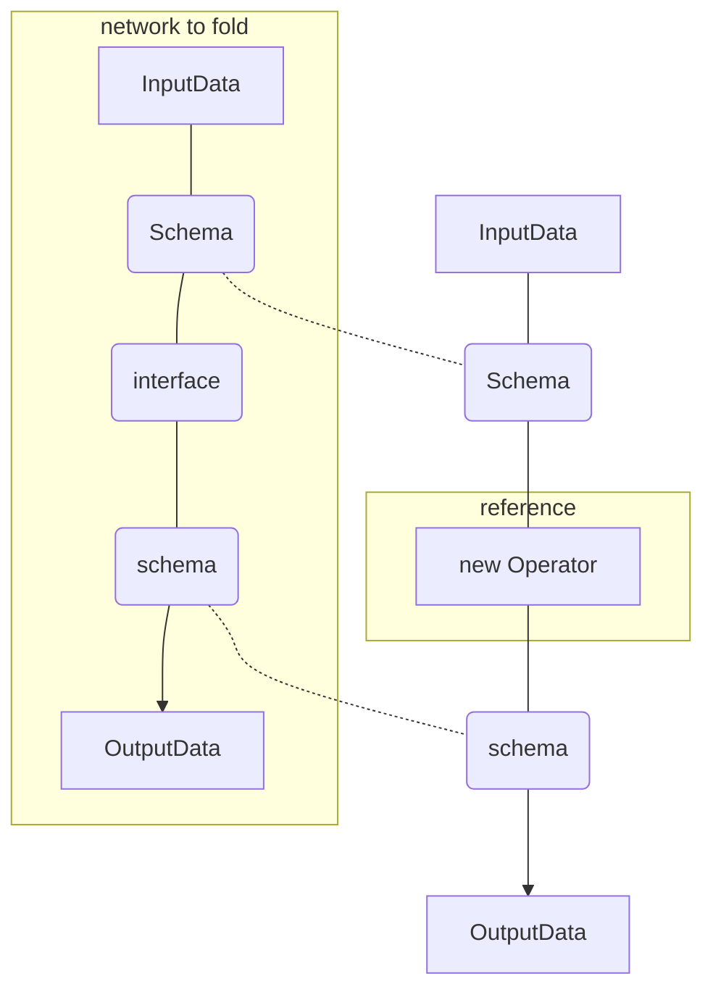

# Elf -- A node based operator network based on taichi-lang
We have the following features:
1. parallel process:with the powerful taichi-lang,we don't have to
write low level compute shader to run parallel algorithm on GPU.
2. dependency graph:like Unreal,Houdini,Blender,we use a dependency
graph to organize an algorithm in higher level,which brings much 
more flexibility and intuitiveness.However,we have made some changes
to improve some aspects.
3. Embed into other Engine by transferring data via socket.This 
overhead may limit the application in per-frame real-time affairs. 
## Application
### Embed Into Unity Or Other Python Program
We have a socket program to handle data transfer and action 
invoke affairs written in both C# and python,giving chance to
embe Elf in Unity.

Normally we hope to use Elf in the field of computer graphics,
like geometry processing,physical simulation,ray tracing rendering,
loading some data from Engine,use an algorithm to process it them
send back.

However,our design is based on general purpose.So Elf may be used
to machine learning,embed into a python program with or without
using the socket program as it is written in python.
## Network
### Basic Node

1. InputData:data in particular access schema while memory schema could vary.
2. Operator:access and even modify data in particular access schema.
3. interface:define a access schema transition between data and operator.
4. duplicate:when accessed by multiple operator,data need to be duplicated,or previous access would affect the latter.However,read only access would not,so there won't be duplication for that.
5. OutputData:data in particular access schema that need to be filled.
### Data flow

1. Both of the data flow can be sent to only one node with compatible access schema then end.
2. main data flow:from where branch data flow could branch.The order of branch indicates the order of process.
3. branch data flow:could not branch.
4. As a result,there only exist one main data flow to determine the only process order.
## Data Schema
### Access Schema

1. Primitive:accessible port in field or variable form of a certain type like int,float3,etc.The access schema can specify field primitive's dim or not,which means any operator processing in such schema should be independent of size on each dimension or even dimension.However,field's shape is changing all the time while accessible,so schema should never specify it.
2. Compound:a namespace for its sub-primitives and sub-compounds.Apart from the name,it should be a reference to another defined access schema.

3. ShapeConstrain:some field primitives are logically struct
of array that different components of a struct are stored in
separate field primitives,which means they share a same shape
and same domain of index.Group some primitives and defined shape
constrain into a new shape constrain,which provide memory
allocation method and a specific index type only allowed to use in
constrain members.
### Interface:Schema Transition


1. connection:define a reference from one of the branch Data's
access port to the existed Data's access port.It can be performed
on two Primitives or two Compound in compatible schema.Performing
on Compound is equal to performing on every component of it.
2. branch Data,exist Data:not a duplication but a reference to an existed Data's subset.
3. input,output data flow:the type of data flow won't change from 
input to output.Branch data flow use this to fit the access schema
of the operator it is sent to;main data flow use this to change access
schema for next part of the network. 
## Duplicate

1. Output multiple main data flow,each one is independent of others.

2. To figure out the way with minimum duplications of port data,collect the following read and write on port for each data flow
3. For each port,according to the number of data flow that read and write on it,decide whether a duplication is needed.
## Network Folding
Network can be folded as operator.


1. The new operator's access schema is the same with the schema
of input data node in the network.
2. The data flow pulled out of the input data node in the network
is always main data flow no matter what the new operator receives.
The process order is to process the network inside an operator then
next operator.
3. If a branch data flow is sent to the new operator,the flow
end,and the operator has no output.However,the output data node
in the network is still make sense by acting as the starting 
point for solving the dependency graph indicated by the network.
4. If a main data flow is sent to the new operator,the operator
generate a main data flow in the schema indicated by the ouput
data node of the network.
## Plugin
In Elf,a project is a plugin.
### Directory Structure
- \<plugin name>
  - infor.json
    ```json
      {
        "dependency": [
          {"URL": "a valid URL of another plugin-loader"}
        ],
        "version":[0,0,1],
        "description": "template plugin-loader for instruction",
      }
    ```
  - code
    - main.py
      ```python
        import meta as elf
        @elf.schema
        class Ray:
          start:elf.vec3[1]#field primitive,dimension is 1
          direction:elf.vec3[1]
          all_sc=elf.ShapeConstrain(start,direction)
        @elf.schema
        class Light:
          ray:Ray#compound:refers to Ray
          energe:float[1]
          line_sc=elf.ShapeConstrain(ray.all_sc,energe)
          density:float[3]#dimension is 3
          mode:int#variable primitive
        @elf.operator
        class MoveLight(elf.Operator):
          def process(self,light:Light):#entry:parameter type determines the schema
              for index in elf.ndrange(light.line_sc.shape):#get shape from ShapeConstrain
                  start=light.ray.start[index]
                  direction=light.ray.direction[index]
                  energe=light.energe[index]
                  light.ray.start[index]+=direction*energe*light.density[round(direction)]*light.mode
      ```
  - network
    - \<network name>
1. ./infor.json:description of the plugin.
2. ./code:define schema,write code for primitive operator.
3. ./code/main.py:an code example.
4. ./network:store network directory build by Elf.
5. ./network/\<network name>:an example network that inner content
should only be accessed via Elf. 
6. When editing a plugin's network in Elf,schemas and operators
defined in the same plugin or its dependent plugin is available.
same plugin 
### Compile To Taichi
```python
  #exists else where
  @taichi.data_oriented
  class ShapeConstrain:
      def __init__(self,shape:tuple[int]):
          self.shape=shape
  #compile result
  @taichi.data_oriented
  class Ray:
      def __init__(self,all_sc:tuple[int]):
          self.start=taichi.field(vec3,shape=all_sc)
          self.direction=taichi.field(vec3,shape=all_sc)
          self.all_sc=ShapeConstrain(all_sc)
  @taichi.data_oriented
  class Light:
      def __init__(self,line_sc:tuple[int],density:tuple[int]):
          self.ray=Ray(line_sc)
          self.energe=taichi.field(float,shape=line_sc)
          self.line_sc=ShapeConstrain(line_sc)
          self.density=taichi.field(float,shape=density)
          self.mode=int()
  @taichi.data_oriented
  class MoveLight:
      @taichi.kernel
      def process(self,light:taichi.template()):
          for index in ndrange(light.line_sc.shape):
              start=light.ray.start[index]
              direction=light.ray.direction[index]
              energe=light.energe[index]
              light.ray.start[index]+=direction*energe*light.density[round(direction)]*light.mode 
```
## Advantages Over The Node System Of Houdini
1. Data are typed by schema.While houdini has no type system.
2. Interface gives an efficient way for operator to
process data in different schema.While houdini have to specify
the way operator interpret the data, on operator itself.
3. Duplication is minimized.While houdini have cache on nealy 
every node.


